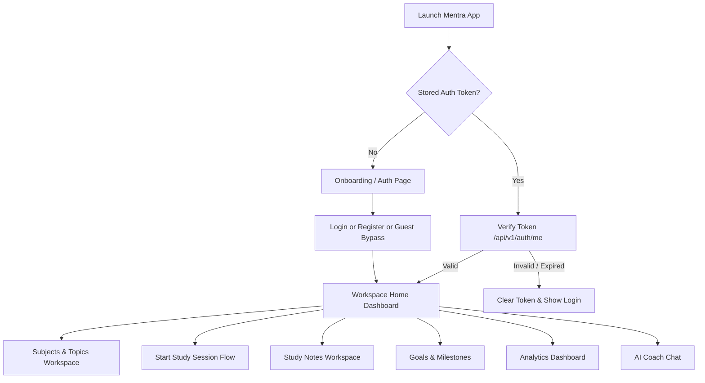
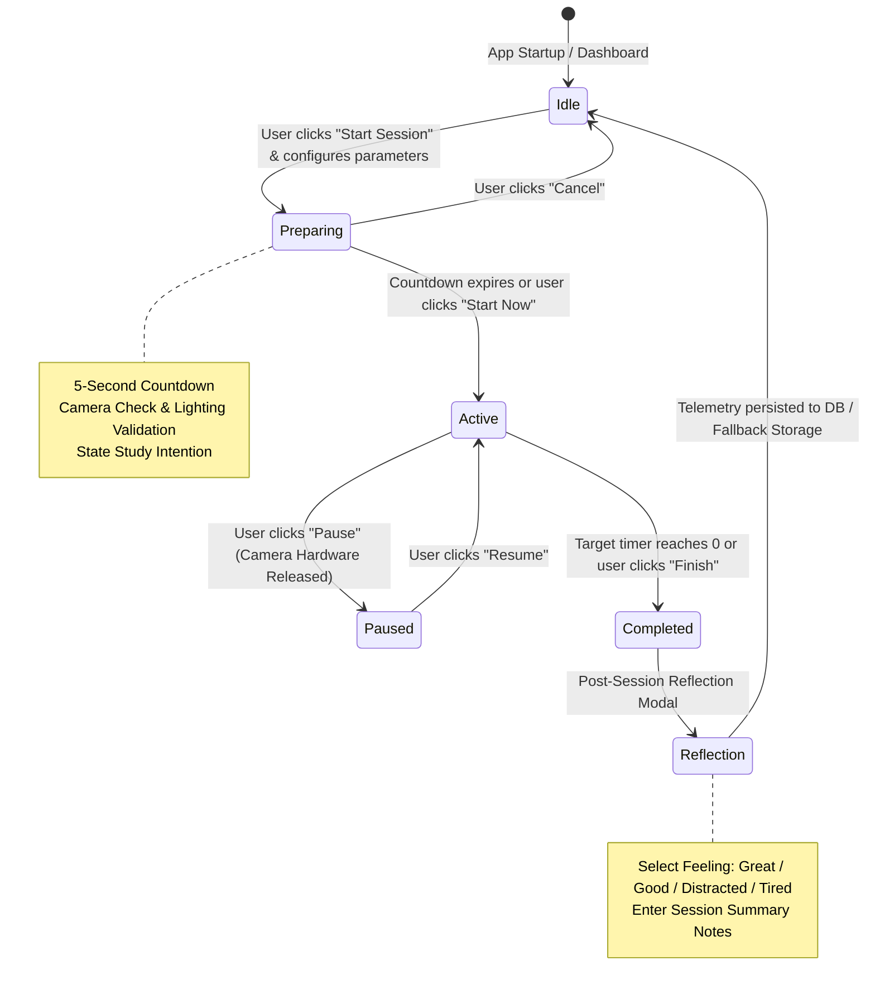
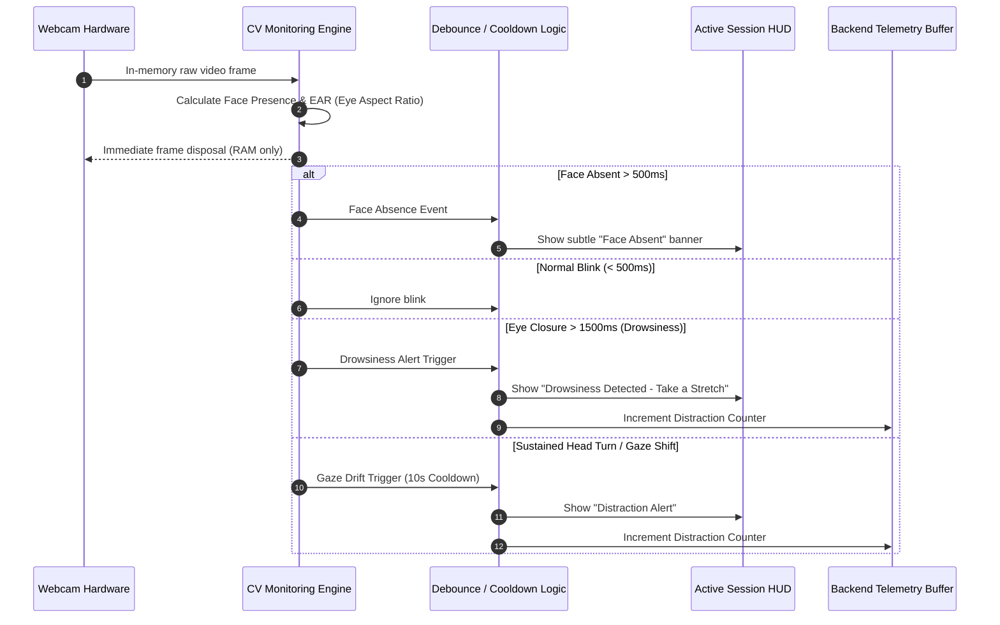
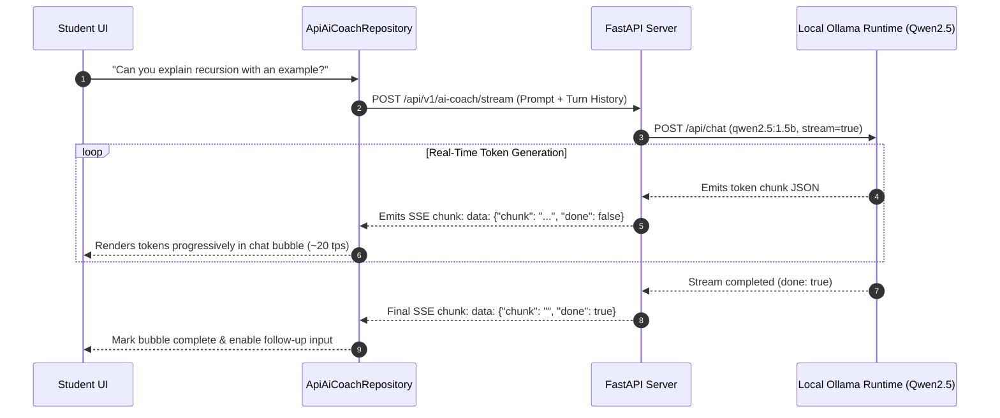
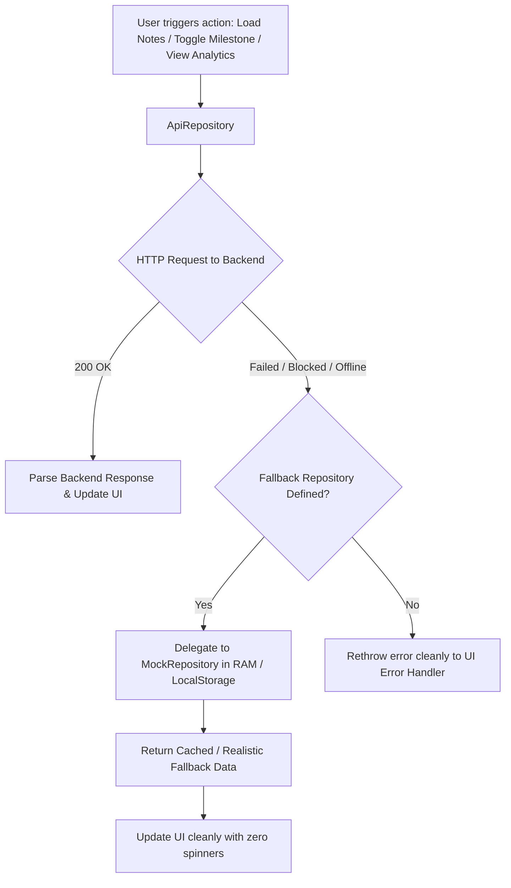

# Mentra — Application Flow & User Journeys (APP-FLOW)

> **Document Version:** 2.0  
> **Status:** Implemented  
> **Platform:** Flutter Desktop & Web  
> **Live Deployment:** [https://mentra-ai-studycoach.netlify.app/](https://mentra-ai-studycoach.netlify.app/)

---

## 1. Global User Journey Map

---

## 2. Five-Stage Study Session Lifecycle

The core study experience is governed by the `SessionController` finite state machine:

---

## 3. Real-Time Computer Vision & Distraction Flow

During an active session, camera frames are evaluated locally on-device:

---

## 4. Local AI Study Coach Conversational Flow

---

## 5. Offline & HTTPS Fallback Flow

When running on Netlify over HTTPS (or when backend is offline), the dual-layer repository architecture prevents network failures from disrupting student workflows:

---

## 6. Navigation & Workspace Sub-Routes

Inside `WorkspaceLayout`, sub-routes transition seamlessly within the main shell:

1. **`AppRoute.home`**:
   - High-level study streak, recent sessions, quick start button.
2. **`AppRoute.subjects`**:
   - `SubjectsPage`: Grid of enrolled courses/subjects.
   - `SubjectWorkspacePage`: Topics, progress bars, hours studied, action buttons.
   - `TopicWorkspacePage`: Topic concept breakdown and notes.
3. **`AppRoute.notes`**:
   - `NotesPage`: Filterable list of study notes with full-text search.
   - `NoteEditorView`: Side-by-side Markdown editor and rendered preview.
4. **`AppRoute.goals`**:
   - `GoalsPage`: Goal cards with milestone checkboxes and progress indicators.
5. **`AppRoute.analytics`**:
   - `AnalyticsPage`: Study metrics, timeline charts, and distraction breakdown.
6. **`AppRoute.aiCoach`**:
   - `AiCoachPage`: Conversational tutor workspace.
7. **`AppRoute.settings`**:
   - `SettingsPage`: Theme selection, monitoring thresholds, and account options.
